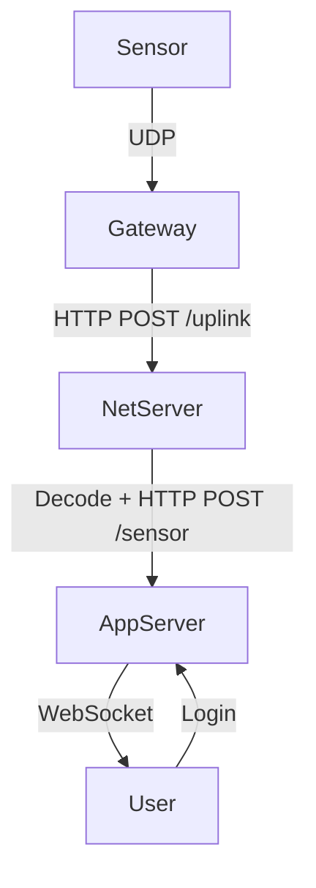
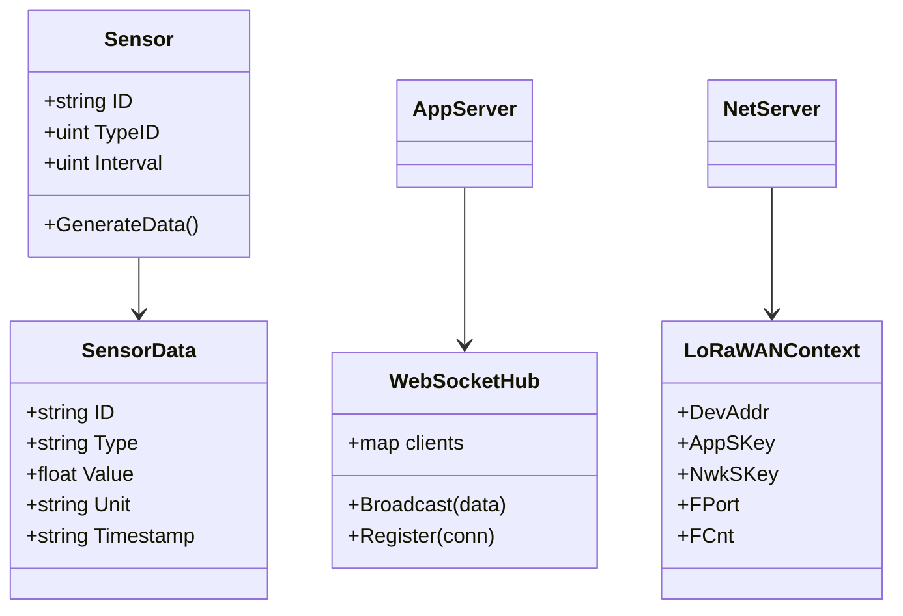
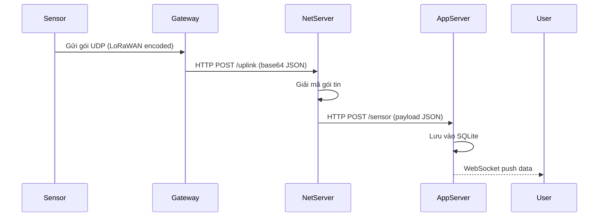
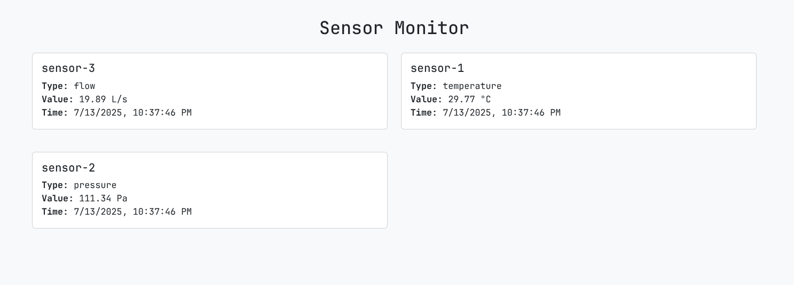
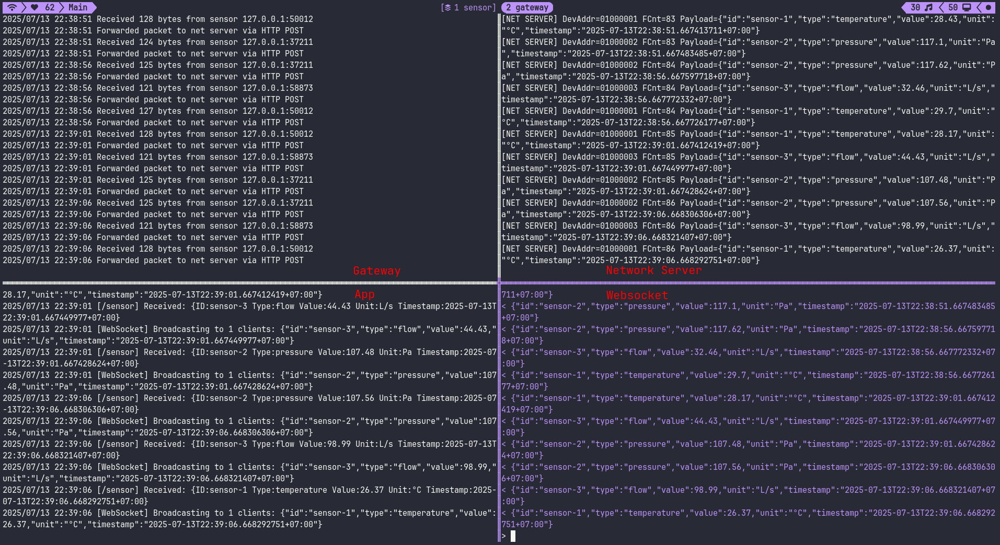

# Mô phỏng hệ thống LoRaWAN

## 1. Giới thiệu

Hệ thống mô phỏng LoRaWAN gồm 4 thành phần chính:

- Sensor:
  - Thiết bị cảm biến ảo
  - Sinh dữ liệu
  - Gửi theo giao thức LoRaWAN.
- Gateway:
  - Nhận dữ liệu qua UDP
  - Gửi lại dữ liệu dưới dạng HTTP JSON.
- Network Server:
  - Giải mã LoRaWAN
  - Chuyển tiếp payload gốc tới App Server.
- Application Server:
  - Lưu và hiển thị dữ liệu cảm biến theo thời gian thực.

---

## 2. Biểu đồ Use Case



---

## 3. Biểu đồ Class Diagram



---

## 4. Biểu đồ Sequence Diagram



---

## 5. Luồng xử lý chi tiết

### Sensor

- Tạo danh sách cảm biến với DevAddr/AppSKey/NwkSKey.
- Sinh dữ liệu ngẫu nhiên và Encode LoRaWAN.
- Gửi dữ liệu qua UDP tới Gateway (127.0.0.1:10001).

### Gateway

- Nhận gói UDP.
- Mã hóa base64, đóng gói JSON.
- Gửi HTTP POST tới Network Server (/uplink).

### Network Server

- Nhận POST uplink, decode base64, parse LoRaWAN packet.
- Xác thực theo DevAddr.
- Decode payload với AppSKey/NwkSKey.
- Gửi payload gốc sang App Server (/sensor).

### App Server

- Nhận JSON payload từ Network Server.
- Ghi vào database SQLite.
- Phát dữ liệu qua WebSocket cho frontend.
- Cung cấp trang giao diện web monitor và login (sử dụng Gorilla Sessions).

---

## 6. Cơ sở dữ liệu (SQLite)

```sql
-- Bảng users
CREATE TABLE users (
  username TEXT PRIMARY KEY,
  password TEXT NOT NULL
);

-- Bảng sensor
CREATE TABLE sensor (
  id TEXT,
  type TEXT,
  value REAL,
  unit TEXT,
  timestamp TEXT
);
```

---

## 7. Cải tiến đề xuất

- [x] Mô phỏng Luồng hoạt động cơ bản
- [ ] Hỗ trợ downlink (2-chiều)
- [ ] Cải thiện Gateway: xử lý giao tiếp với Concentrator (Thay thế mô phỏng UDP bằng giao tiếp SX1301)
- [ ] Cải thiện Network Server: Hỗ trợ nhiều Gateway
- [ ] Hỗ trợ chạy Container (Docker)
- [ ] Hỗ trợ chạy Trên Cloud (AWS)
- [ ] Thay sqlite bằng PostgreSQL + JWT login
- [ ] Giao diện frontend:
  - Thêm biểu đồ
  - Cải thiện giao diện quản lý
  - Thêm các tính năng (lệnh điều khiển, downlink,...)

## Hình ảnh



